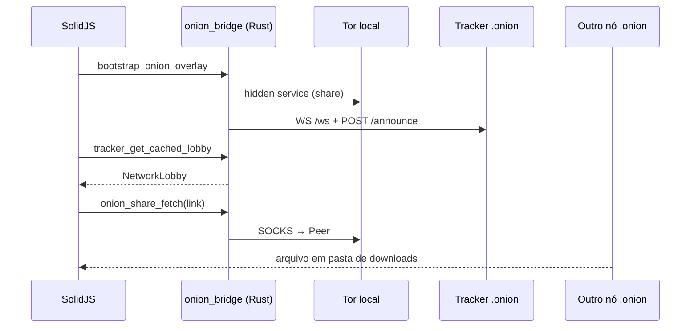

# Arquitetura de rede — AlLibrary (estado atual)

Visão da conectividade P2P **como o projeto funciona hoje**, não apenas como ideal de produto.

---

## Resposta direta: transferência entre redes distantes?

**Sim, no caminho de produção atual:** Tor Hidden Services + tracker de presença.

O cliente **não** depende de IP público nem port forwarding. Cada nó:

1. Sobe um **Tor embarcado** e um **servidor HTTP local** de compartilhamento (onion-share).
2. Publica um endereço **`.onion`** e anuncia metadados (nome, hash, link) ao **tracker**.
3. Outros nós consultam o lobby do tracker e baixam via **`onion_share_fetch`** (SOCKS5 → link `.onion` do peer).

---

## Stack em produção (v1.0.x)

| Camada | Implementação | Papel |
|--------|---------------|--------|
| UI | SolidJS (`src/`) | Telas Library / Discovery / P2P Network |
| Ponte Tauri | `onion_bridge` + `onionShareService.ts` | Tor, shares, tracker, downloads |
| Tracker | Repositório **`TrackerRust_AlLibrary`** (`allibrary-tracker` v0.7.4) | Lobby em RAM; HTTP + WebSocket |
| Dados locais | SQLite `documents/allibrary.db` | Coleções (CRUD); **cache de rede planejado** |
| Legado (não-UI) | `init_p2p_node`, Kademlia, libp2p | Comandos Tauri existem; **não** são o fluxo principal da UI |

Plano de integração detalhado: [integration/README.md](./integration/README.md).

---

## Fluxo de dados (simplificado)

---

## Tracker (“lista telefônica”)

- **Não** armazena bytes de arquivo.
- Mantém **nós online** e **metadados** (hash, nome, tamanho, link `.onion`).
- TTL ~30s + remoção imediata ao fechar WebSocket.
- Deploy recomendado: Docker Compose em `TrackerRust_AlLibrary/` (tracker + `tor_service`).

Configuração no cliente: `src-tauri/src/onion_share/config.rs` (default `tracker_url`) ou **Configurations** (`/connection-manager`) em runtime.

---

## UI vs backend (honestidade)

| Área | Estado |
|------|--------|
| Bootstrap Tor + announce no boot | Funcional |
| Download via link `.onion` | Funcional (`downloadManager` + `onion_share_fetch`) |
| Busca na rede por título | Funcional via lobby do tracker (`p2pNetworkService.searchNetwork`) |
| Métricas de throughput / libp2p | **Não** alimentam a UI (valores zerados ou mock) |
| Telas POC **Global Acervo** e painel **Onion mesh (live)** | Funcionais como POC; **serão removidas** — capacidades migram para Search Network, Sharing & downloads, Configurations |
| Várias telas Discovery/P2P | Layout pronto; parte ainda usa **dados mock** |

---

## Privacidade

- Tráfego entre peers passa pela rede Tor (camadas criptografadas).
- Tracker vê apenas metadados e endereços `.onion`, não conteúdo.
- IPs reais dos peers não são expostos um ao outro via links onion.

---

## Documentos relacionados

- [TRACKER_SERVER.md](./TRACKER_SERVER.md) — protocolo HTTP/WS
- [P2P_INTEGRATION.md](./P2P_INTEGRATION.md) — integração no desktop
- [CONECTIVIDADE_GLOBAL.md](./CONECTIVIDADE_GLOBAL.md) — cenário Brasil ↔ Japão
- [DESCENTRALIZACAO_COMPLETA.md](./DESCENTRALIZACAO_COMPLETA.md) — evolução futura (DHT/gossip)
