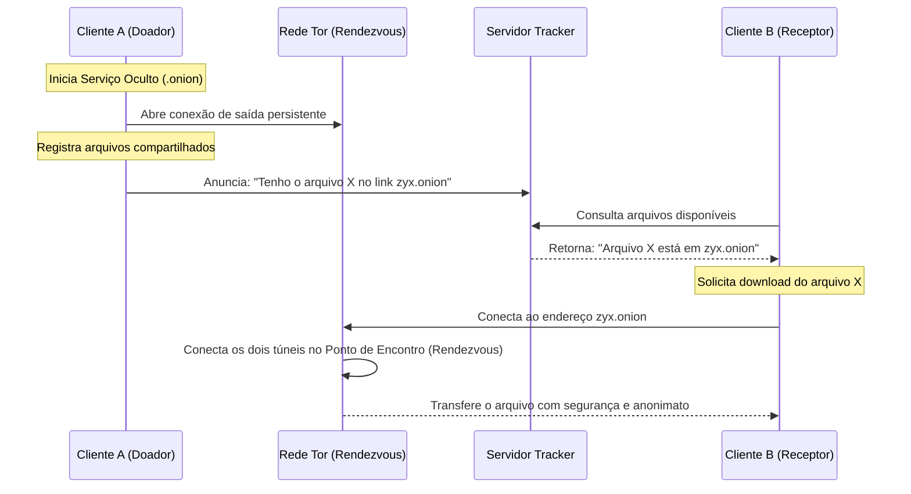

# 🏛️ Arquitetura de Rede P2P e Conectividade do AlLibrary

Este documento explica como o AlLibrary gerencia a comunicação P2P e como ele permite o compartilhamento de arquivos entre computadores em **redes totalmente distantes** (como cidades diferentes, países diferentes ou atrás de firewalls rígidos).

---

## ❓ O aplicativo consegue transferir arquivos entre redes distantes?

**Sim!** O AlLibrary foi projetado especificamente para isso. 

Normalmente, para que dois computadores se conectem diretamente pela internet (P2P tradicional), ambos ou pelo menos um deles precisaria de:
1. **IP Público Dedicado** (cada vez mais raro devido ao CGNAT das operadoras).
2. **Redirecionamento de Portas (Port Forwarding)** configurado manualmente no roteador.
3. Desativação de **Firewalls** locais.

O AlLibrary contorna todas essas barreiras utilizando a **rede Tor (Onion Hidden Services)**.

---

## 🌐 Como a Magia Ocorre: Ultrapassando Firewalls e CGNAT

Em vez de abrir portas públicas no seu roteador doméstico, o AlLibrary utiliza o Tor como um túnel de **Rendezvous (Ponto de Encontro)**.

### Explicação Passo a Passo:

1. **Abertura de Conexões de Saída**: Quando o Tor inicia em seu computador, ele faz uma conexão de *saída* para a rede Tor pública. Firewalls domésticos e CGNAT **não bloqueiam** conexões de saída (apenas de entrada).
2. **Criação do Serviço Oculto (.onion)**: O aplicativo cria um endereço virtual criptográfico único (ex: `exemplo123456789.onion`). Esse link representa a sua máquina dentro da rede Tor.
3. **Ponto de Encontro (Rendezvous Point)**: Quando o Cliente B quer baixar do Cliente A, ambos se conectam a um terceiro nó intermediário na rede Tor (o ponto de encontro). A conexão é estabelecida de forma bidirecional sem que o Cliente A ou o Cliente B precisem expor seus IPs reais ou configurar roteadores.

---

## 🧭 O Papel do Tracker Server ("Lista Telefônica")

Como os endereços `.onion` são gerados dinamicamente e mudam quando as chaves de sessão são limpas, os clientes precisam de um ponto centralizado para se localizarem. É aqui que entra o **Tracker**:

- O Tracker **não hospeda nem trafega os arquivos**.
- Ele atua apenas como uma **lista telefônica dinâmica em memória**.
- Quando o aplicativo do doador está online, ele avisa o tracker: *"Eu sou o nó X, meu endereço Tor ativo é Y.onion, e estou compartilhando os arquivos A, B e C"*.
- Quando o receptor abre o aplicativo, ele lê o lobby do tracker para descobrir automaticamente quem está online e quais arquivos estão disponíveis para download imediato (Conhecido como **Zero-Search Discovery**).

---

## 🛡️ Resistência à Censura e Anonimato

- **Ponta a Ponta Criptografado**: Toda a comunicação dentro da rede Tor é criptografada por padrão, impedindo que provedores de internet (ISPs) ou intermediários saibam qual arquivo está sendo baixado.
- **Metadata Protegido**: Como as conexões são roteadas através de múltiplos saltos criptografados, o receptor não conhece o IP físico do doador, e o doador não conhece o IP físico do receptor.
