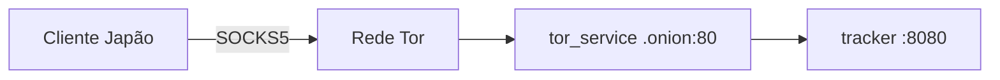

# Conectividade global (Tor + tracker)

Cenário real: usuário no Japão e tracker no Brasil (ou VPS), **sem** configurar roteador.

---

## Pré-requisitos

1. **Tracker** publicado em `.onion` (Docker em `TrackerRust_AlLibrary/`).
2. Cliente com o **mesmo** `tracker_url` em `onion_share/config.rs` ou em **Configurations** (`/connection-manager`).
3. Tor embarcado ativo no cliente (automático após splash, salvo falha).

URL `.onion` do hidden service do tracker usa **porta virtual 80** — não `:8080` na URL pública Tor. Localhost para dev: `http://127.0.0.1:8080`.

---

## Fluxo passo a passo

### 1. Cliente no Japão abre o app

- `initialize_app` → splash
- `ensure_tor_for_onion_share` → Tor bundle se necessário (Windows)
- `bootstrap_onion_overlay` → hidden service de **share** + announce ao tracker
- Opcional: `init_tor_node` (legado; falha silenciosa comum — onion-share usa Tor próprio)

### 2. Registro no tracker

- HTTP `POST /announce` e/ou WebSocket `/ws` com JSON `type: "announce"`.
- Payload: `node_id`, `onion`, lista `files[]` (`AnnouncedFile`).
- Tracker responde/atualiza lobby; outros clientes recebem `type: "lobby"` no WS.



### 3. Compartilhar arquivo (Japão)

- UI: **Sharing & downloads** (`/transfers`) — adicionar ficheiros (`onion_share_add_file`).
- Rust gera link `http://{seu.onion}/…` e re-anuncia ao tracker.

### 4. Descobrir e baixar (Brasil)

**Hoje (POC):** tela **Global Acervo** (`/acervo`) lista o lobby e dispara download.

**Alvo (pós-integração):** **Search Network** (`/search-network`) com query vazia + **Sharing & downloads** para progresso — ver [integration/02-poc-retirement-and-capability-migration.md](./integration/02-poc-retirement-and-capability-migration.md).

Download: `onion_share_fetch(link, pastaDownloads)` via `downloadManager`; pasta definida no first-run / `settingsService`.

---

## Por que funciona atrás de firewall/CGNAT

- Conexões são majoritariamente de **saída** para a rede Tor.
- Endereços `.onion` identificam serviços sem IP público no cliente.
- Rendezvous Tor une downloader e seeder sem port forwarding.

---

## Sincronização do lobby

- WebSocket persistente + fallback HTTP `/lobby`.
- Cliente re-anuncia periodicamente (~5s no WS loop).
- Nó expira no tracker após ~30s sem announce.
- Desconexão WS remove o nó imediatamente.

**Nota:** documentação antiga citava “pings do servidor a cada 30s”; o tracker **não** envia ping proativo — usa TTL + re-announce do cliente.

---

## Fallback localhost (mesmo PC)

Se `try_local_tracker_fallback` estiver ativo e o `.onion` falhar, o cliente tenta `http://127.0.0.1:8080` (Docker Desktop mapeando a porta).

---

## Checklist operacional

```bash
# Hostname do tracker
docker compose -f TrackerRust_AlLibrary/docker-compose.yml exec tor_service \
  cat /var/lib/tor/hidden_service/hostname

# Debug de nós
docker compose exec tracker curl -s http://localhost:8080/debug/nodes
```

Sincronizar hostname com `tracker_url` no cliente antes de distribuir instaladores.
