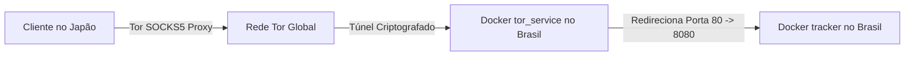

# 🌍 Conectividade Global: Do Brasil ao Japão via Tor

Este documento detalha o cenário real de comunicação global do **AlLibrary**. Aqui explicamos passo a passo como um usuário no Japão consegue ver, interagir e transferir arquivos P2P com você (rodando o servidor no Brasil), de forma totalmente transparente e segura.

---

## 📋 O Cenário

*   **Seu Servidor (Brasil)**: Você rodou o `docker compose up -d --build` em seu computador ou em uma VPS no Brasil. O Tor gerou o link:
    `http://3anhnwqwxmjo7xsyxs3uoocdctxd3nwkfm5lt36xcwi4hfmkbttoktqd.onion`
*   **O Usuário (Japão)**: Baixou e executou o seu aplicativo compilado `.exe` ou executável Linux. Ele está conectado a um provedor de internet residencial comum no Japão.

---

## 🛠️ Como Funciona o Fluxo de Conexão Passo a Passo

### Passo 1: Inicialização do App no Japão
1. O usuário no Japão abre o AlLibrary.
2. O aplicativo inicia o processo interno do **Tor** em segundo plano no computador dele.
3. O Tor local do usuário se conecta à rede distribuída global do Tor (estabelecendo túneis de saída cifrados).

### Passo 2: Registro no Tracker Global
1. O aplicativo no Japão lê a configuração padrão:
   `tracker_url: "http://3anhnwqwxmjo7xsyxs3uoocdctxd3nwkfm5lt36xcwi4hfmkbttoktqd.onion"`
2. Através do proxy SOCKS5 local, o aplicativo faz uma requisição HTTP/WebSocket para o endereço do seu tracker.
3. A requisição viaja de forma criptografada por 3 nós intermediários na rede Tor (guard, middle, rendezvous) até chegar ao contêiner `tor_service` que você subiu no Brasil.
4. O contêiner `tor_service` no Brasil repassa a conexão para o contêiner `tracker` (porta `8080`).
5. **Resultado Instantâneo**: O usuário no Japão agora é registrado como ativo. O contador de nós online sobe em todas as máquinas conectadas à rede.

### Passo 3: Compartilhando Arquivos
1. O usuário no Japão adiciona um livro de 15MB à sua pasta compartilhada do AlLibrary.
2. O aplicativo dele cria um **Onion Service próprio** temporário ou permanente (ex: `japaopeer12345.onion`) na rede Tor dele.
3. O aplicativo dele envia uma mensagem WebSocket para o seu Tracker no Brasil contendo:
   - O nome do arquivo.
   - O tamanho do arquivo.
   - O hash SHA-256 do arquivo.
   - O link de download: `http://japaopeer12345.onion/download/livro.epub`

### Passo 4: Descoberta e Download no Brasil
1. No seu computador no Brasil (ou no de qualquer outra pessoa conectada ao Tracker), a aba **Global Acervo** se atualiza automaticamente em menos de 5 segundos.
2. O livro compartilhado no Japão aparece na sua tela como disponível.
3. Você clica em **Download**.
4. O seu aplicativo local cria um canal de download direto conectando-se a `http://japaopeer12345.onion`.
5. O arquivo viaja criptografado da máquina do Japão diretamente para a sua pasta de Downloads no Brasil.

---

## ⚡ Por que este sistema funciona "de forma perfeita"?

### 1. Zero Configuração de Roteador (NAT Traversal)
Em sistemas P2P tradicionais, para que você receba uma conexão de alguém de fora, você precisaria abrir portas no seu modem doméstico. No AlLibrary isso **não é necessário**:
* Tanto o cliente no Japão quanto o seu servidor no Brasil realizam apenas conexões de **saída** para a rede Tor.
* Como os roteadores residenciais e firewalls permitem conexões de saída por padrão, a conexão é estabelecida de forma transparente. O Tor atua como o ponto de encontro.

### 2. Contorno de CGNAT
A maioria dos provedores de internet hoje coloca os usuários atrás de **CGNAT** (onde vários clientes compartilham o mesmo IP público). Isso impede conexões diretas entre computadores. O uso de endereços virtuais `.onion` resolve isso completamente, permitindo endereçamento global individual.

### 3. Independência Geográfica
A rede Tor possui milhares de servidores espalhados pelo mundo. Não importa a distância física: a rota é resolvida dinamicamente, permitindo que a troca de dados ocorra de qualquer lugar do mundo que tenha acesso à internet.

### 4. Sincronização em Tempo Real com WebSockets
Graças à conexão persistente por WebSockets introduzida na **v0.7.4**, o status dos arquivos e usuários online é atualizado instantaneamente sem sobrecarregar a rede com requisições repetitivas (polling). Se o usuário no Japão fechar o notebook, o arquivo dele some da lista do Acervo de todos no mesmo segundo.
