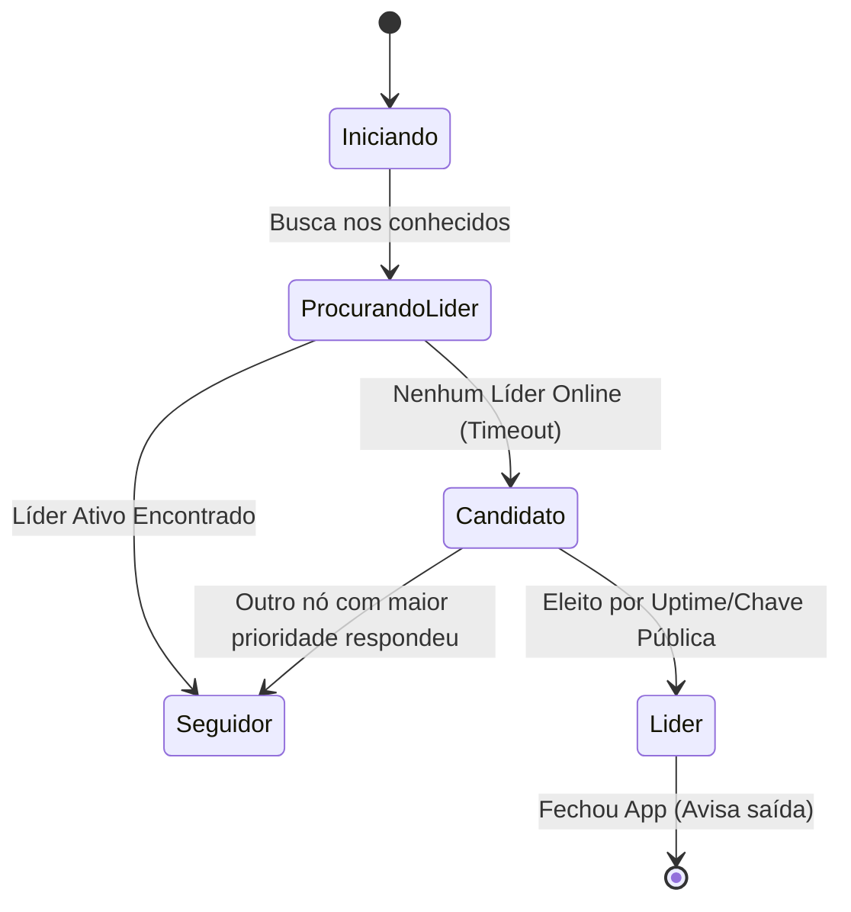

# 🧠 Arquitetura de Descentralização Completa: Gossip, Kademlia e Eleição de Líder sobre Tor

Este documento apresenta uma análise técnica e acadêmica sobre a viabilidade de eliminar o Tracker Server externo (Docker) do **AlLibrary**, movendo a rede para um estado de **descentralização pura**. Ele serve como base conceitual e científica para enriquecer a fundamentação teórica e as seções de "Trabalhos Futuros" ou "Evolução da Arquitetura" do seu **TCC**.

---

## 🧭 1. Veredito Acadêmico e Técnico

### **É viável? Sim, absolutamente!**
Na engenharia de sistemas distribuídos, é perfeitamente viável embutir toda a lógica de coordenação dentro do próprio executável cliente. Redes consagradas como **BitTorrent (através de Mainline DHT)** e **IPFS (via libp2p)** operam exatamente sob esse princípio: o aplicativo do usuário final é, ao mesmo tempo, cliente, servidor de arquivos e nó de roteamento.

---

## 🛠️ 2. Como seria a Arquitetura Sem Servidor Externo?

Para que o aplicativo funcione de forma autônoma e sem necessidade de uma máquina dedicada rodando Docker para o Tracker, o sistema precisaria de três pilares:

### A. Tracker Embutido (Embedded Server)
Ao invés de rodar o Tracker em uma máquina separada, o próprio código em Rust (Tauri) do aplicativo inicia um servidor leve (ex: usando a biblioteca `axum` ou `tokio` em uma thread paralela). 
* Quando o app abre, ele cria **dois** Hidden Services no Tor:
  1. Um para a transferência de arquivos (`onion-share`).
  2. Outro para atuar temporariamente como um "servidor de presença" (Lobby/Tracker), se necessário.

### B. Tabela Hash Distribuída (Kademlia DHT)
Para eliminar totalmente a necessidade de qualquer "Tracker", o descobrimento de arquivos pode ser feito via **Kademlia DHT**:
* **Chave-Valor:** Cada arquivo é representado pelo seu hash (SHA-256 ou CID IPFS). 
* **Distância XOR:** A rede mede a "distância" entre o hash do arquivo e o ID público de cada computador (Node ID) usando a operação matemática **XOR**.
* **Armazenamento Distribuído:** O anúncio do arquivo não vai para um servidor central; ele é salvo nos $k$ computadores cujos Node IDs sejam matematicamente mais "próximos" do hash do arquivo.
* **Busca Sem Tracker:** Para baixar um arquivo, seu computador pergunta aos computadores conhecidos: *"Quem está mais perto desse Hash?"*. A pergunta navega pelos nós (saltos) até encontrar quem guarda a informação do link `.onion` de download.

### C. Protocolos Epidêmicos (Gossip)
Para que os nós espalhem informações rápidas (como a lista de usuários online ou mensagens de chat) de forma leve:
* **Fofoca Cíclica:** Um nó escolhe aleatoriamente $k$ vizinhos (ex: 3 ou 4 máquinas) e envia seu status de presença.
* **Propagação Exponencial:** Esses vizinhos repassam a informação para outros $k$ vizinhos. Em poucos segundos, a informação sobre quem está online "contamina" (como uma epidemia saudável) toda a rede.

---

## 👑 3. O Mecanismo de Eleição de Líder (Coordenação Dinâmica)

Se a sua aplicação se beneficia de ter um "Tracker" ativo (porque concentrar a lista de arquivos temporariamente em uma máquina reduz o número de conexões na rede Tor), podemos usar um algoritmo de **Eleição de Líder** (como o **Algoritmo do Valentão / Bully Algorithm** ou uma versão simplificada do **Raft Consensus**):

### Regras do Algoritmo Epidêmico de Eleição:
1. **Critério de Senioridade (Uptime):** O computador que está online há mais tempo (maior estabilidade de rede) recebe maior peso de voto. Em caso de empate, a menor chave criptográfica (ordem alfanumérica do endereço `.onion`) vence.
2. **Monitoramento por Heartbeat (Batimento Cardíaco):** O nó Líder (Tracker temporário) envia pequenos sinais WebSocket para os outros nós a cada 5 segundos.
3. **Substituição Automática (Failover):** Se o Líder desligar o PC, os outros nós param de receber o *heartbeat*. Após um timeout de 15 segundos, o segundo computador mais antigo na rede assume o papel de novo Líder, cria o Hidden Service do Tracker e avisa toda a rede via Gossip: *"Eu sou o novo coordenador"*.

---

## 🚧 4. Desafios de Implementação: O que falta para o "Estado da Arte"?

Apesar de teoricamente lindo, implementar isso **sobre a rede Tor** enfrenta limitações físicas e práticas:

1. **Latência de Criação de Circuitos Tor:**
   O maior gargalo do Tor é o tempo para criar um canal oculto (túnel rendezvous), que demora de 10 a 30 segundos. Em uma DHT Kademlia comum (onde cada busca exige perguntar para 4 ou 5 computadores diferentes sequencialmente), fazer isso abrindo novos circuitos Tor tornaria uma simples busca de arquivo extremamente lenta (demorando mais de 2 minutos).
2. **Nós de Entrada Estáveis (Bootstrap Nodes):**
   Mesmo uma rede 100% descentralizada precisa de um "ponto de partida". Um computador novo que acabou de instalar o app no Japão não consegue adivinhar quem está online. Ele precisa de pelo menos **um** endereço `.onion` ou IP fixo gravado no código para fazer a primeira conexão e obter a lista inicial de parceiros (Peers).
3. **Consumo de Banda e Processamento:**
   Manter conexões WebSocket ativas com múltiplos nós simultaneamente via Tor consome processamento de criptografia (TLS/Onion) constante. Em computadores fracos, isso pode causar lentidão na CPU.

---

## 🎓 5. Impacto Científico para o seu TCC

Apresentar este modelo conceitual na sua monografia demonstra **maturidade acadêmica** e profundo conhecimento de engenharia de software. Você pode estruturar o capítulo da seguinte forma:

*   **Fase Atual (Protótipo do TCC):** Rede híbrida P2P com Tracker Centralizado via Tor (baixo consumo, alta velocidade de resposta, facilidade de auditoria e monitoramento de conexões para validação da banca).
*   **Fase Futura (Proposta Teórica):** Rede P2P pura com DHT Kademlia adaptada para alta latência Tor e Eleição Dinâmica de Coordenador por tempo de atividade (*Uptime-based Leader Election*). Isso prova que o sistema é resiliente mesmo se o criador do projeto desligar o servidor principal.
