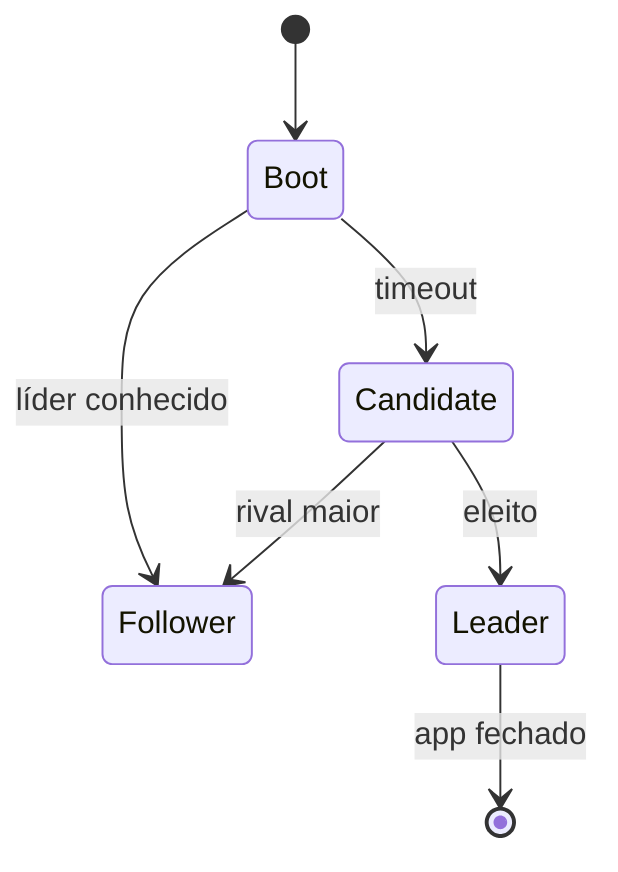

# Descentralização completa — visão futura vs. protótipo atual

Este documento separa **o que o AlLibrary faz hoje** do **modelo acadêmico** (DHT, gossip, eleição de líder) útil para TCC e trabalhos futuros.

---

## Estado atual (protótipo v1.0.x)

| Aspecto | Implementação real |
|---------|-------------------|
| Descoberta de peers/arquivos | **Tracker centralizado** (`TrackerRust_AlLibrary`) sobre `.onion` |
| Transferência | **Tor onion-share** peer-a-peer (links `.onion`) |
| NAT / firewall | Tor hidden services |
| DHT Kademlia / Gossip | Código **legado** em `src-tauri` (`network_shell`, libp2p) — **não** usado pela UI principal |
| IPFS | Não integrado ao fluxo de produção |
| Tracker embutido no `.exe` | Existe binário `src-tauri/src/bin/tracker.rs` (duplicata); deploy canônico no repo standalone |

**Veredito:** rede **híbrida** — P2P nos ficheiros, **coordenação centralizada** no tracker. Adequado para validação, baixa latência de lobby e simplicidade operacional.

---

## Visão futura (pesquisa / TCC)

Eliminar o tracker Docker e usar apenas clientes:

### A. Tracker embutido (embedded)

Cada app poderia expor um mini-servidor Axum + hidden service “lobby” temporário. Hoje já há código similar em `bin/tracker.rs` e `TrackerRust_AlLibrary`.

### B. Kademlia DHT

Anúncios keyed por hash SHA-256; lookup por saltos XOR. **Desafio sobre Tor:** latência de circuitos (10–30s) multiplicada por várias consultas DHT.

### C. Gossip

Propagação epidémica de presença entre vizinhos aleatórios.

### D. Eleição de líder

Algoritmo tipo Bully/Raft simplificado: um nó atua como tracker temporário; failover se heartbeat falhar.

---

## Desafios (continuam válidos)

1. **Latência Tor** — DHT “clássico” fica lento demais sem cache agressivo.
2. **Bootstrap** — sempre é necessário pelo menos um `.onion` ou peer conhecido no binário/config.
3. **CPU/banda** — muitos WebSockets sobre Tor em nós fracos.

---

## Caminho evolutivo sugerido (produto)

1. **Curto prazo:** tracker externo + **cache SQLite por nó** (lobby offline) — [integration/01-data-model-and-node-directory.md](./integration/01-data-model-and-node-directory.md).
2. **Médio prazo:** múltiplos trackers bootstrap + sync entre caches.
3. **Longo prazo:** DHT/gossip só se métricas de latência forem aceitáveis em testes reais.

---

## Uso no TCC

- **Capítulo implementado:** Tor + tracker + onion-share (mensurável, demonstrável).
- **Capítulo futuro:** DHT + eleição sobre Tor (análise de viabilidade, não claim de “já implementado”).

Não confundir comandos libp2p registrados no Tauri com o comportamento que o utilizador vê na interface hoje.
