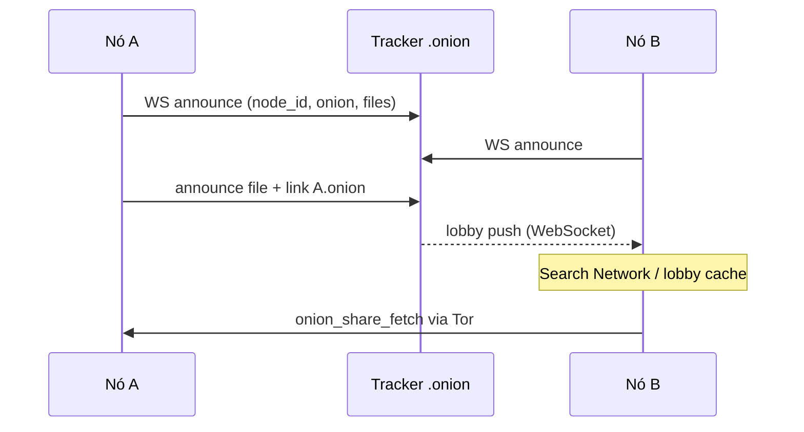

# P2P e descoberta — como funciona hoje

Respostas alinhadas ao código em **maio/2026** (branch `integration`).

---

## Funciona sem configurar nada?

**Parcialmente sim**, se:

1. O instalador embute o `tracker_url` correto (`src-tauri/src/onion_share/config.rs`), **e**
2. Esse tracker `.onion` está no ar (volume Docker `tor_keys` preservado).

Se o `.onion` mudar, o utilizador deve atualizar em **Configurations** → `/connection-manager` (campo Tracker URL). A função `normalize_tracker_url` remove `:8080` de URLs `.onion`.

**First run:** pasta do projeto (ex. `D:\AlLibrary`) via wizard — obrigatória para biblioteca local; não substitui o URL do tracker.

---

## Por que não usamos Gossip/Kademlia/IPFS na UI?

| Necessidade | Solução atual |
|-------------|----------------|
| NAT / CGNAT | Tor hidden services |
| Quem está online e com quê | Tracker WS + HTTP (`NetworkLobby`) |
| Rota | Tor (SOCKS5 no cliente) |
| Integridade | `content_hash` SHA-256 no announce |

libp2p/Kademlia existem como **comandos Tauri legados**; a UI usa **`p2pNetworkService`** fino sobre **`onionShareService`** + lobby do tracker.

---

## Fluxo entre duas cidades



**UI de descoberta:**

| Tela | Estado |
|------|--------|
| `/search-network` | Busca por título no lobby (Tor-gated) |
| `/acervo` (Global Acervo) | POC — listagem automática; **a remover** |
| `/peers` | Mock — deve usar `discoverPeers()` |

---

## Componentes no desktop

### Rust (`src-tauri/src/onion_share/`)

- `server.rs` — HTTP share local
- `tracker_client.rs` — announce, WS, `/lobby`
- `tracker_proto.rs` — tipos JSON (espelho do tracker standalone)
- `config.rs` — `tracker_url`, `node_id`, flags

### Comandos Tauri (`onion_bridge`)

`bootstrap_onion_overlay`, `onion_share_*`, `tracker_*`, `onion_share_fetch`

### Frontend

- `onionShareService.ts` — invoke
- `downloadManager.ts` — fila + evento `onion-share-fetch-done`
- `p2pNetworkService.ts` — search = filtrar lobby; peers = node_ids únicos

---

## Checklist antes de release

```bash
# Tracker (repo standalone)
cd TrackerRust_AlLibrary
docker compose up -d --build
docker compose exec tor_service cat /var/lib/tor/hidden_service/hostname
```

1. Copiar hostname para `config.rs` ou documentar URL para Configurations.
2. Teste local rápido: `tracker_url = http://127.0.0.1:8080` + Docker port 8080.
3. Dois clientes ou um cliente + curl em `/lobby` após announce.

Ver [TESTING_P2P.md](./TESTING_P2P.md).

---

## Próximos passos (documentados)

[integration/](./integration/) — SQLite cache, remoção de POCs, facades `networkFacade` / `transferFacade`.
