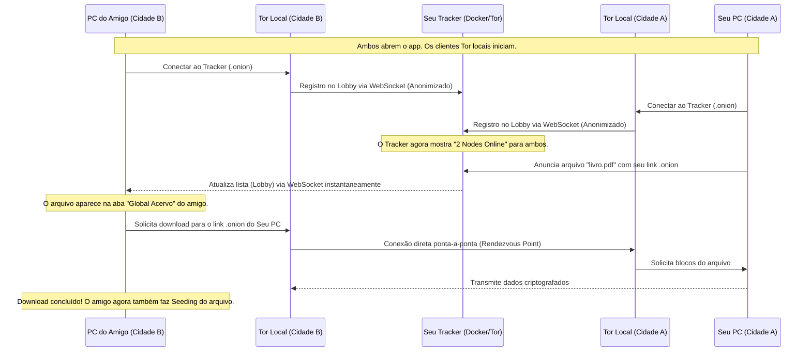

# 🧬 Detalhamento da Rede P2P: Descobrimento e Conectividade Sem Configuração

Este documento responde de forma definitiva às dúvidas arquiteturais do projeto **AlLibrary**, detalhando como o descobrimento de rede, o roteamento e a transferência de arquivos acontecem mundialmente sem necessidade de protocolos complexos como Gossip, Kademlia ou IPFS ativos na versão atual, e sob quais condições o sistema funciona de forma "plug-and-play" (zero configuração).

---

## 📢 Veredito Rápido: Funciona Sem Configurar Nada?

### **SIM!**
Se o instalador `.exe` (ou executável Linux/macOS) gerado pelo GitHub Actions estiver com o **link `.onion` do seu Tracker Server** embutido no código padrão, **qualquer pessoa no mundo poderá baixar, abrir o app e compartilhar arquivos instantaneamente sem configurar nada**.

> [!IMPORTANT]
> **O único pré-requisito para ser 100% automático:**
> O endereço `.onion` gerado pelo seu contêiner Docker local (`tor_service`) precisa ser exatamente o mesmo configurado como padrão no código do cliente (`AppConfig.tracker_url` no arquivo `src-tauri/src/onion_share/config.rs`).
>
> *   Se o domínio `.onion` mudou (por exemplo, se você recriou os contêineres sem o volume de chaves persistente), qualquer usuário externo ainda conseguirá usar o app, mas precisará ir em **Configurações → Gerenciador de Conexões** no app e colar o seu novo link `.onion`.

---

## 🛠️ Por que o App funciona sem Gossip, Kademlia ou IPFS?

Em redes P2P tradicionais (como BitTorrent ou IPFS), utilizam-se tabelas hash distribuídas (**Kademlia DHT**) e protocolos de fofoca (**Gossip**) para que um nó encontre outros nós sem depender de servidores.

No **AlLibrary**, optou-se por uma arquitetura muito mais eficiente e segura para ambientes restritivos: **Tor Onion Services + Tracker Server Centralizado sobre Canais WebSocket**.

Aqui está a comparação de como as funções do Gossip/Kademlia/IPFS foram substituídas:

| Função Necessária | Como IPFS / Kademlia / Gossip resolvem | Como o AlLibrary + Tor + Tracker resolvem |
| :--- | :--- | :--- |
| **NAT Traversal (Passar por Firewalls)** | STUN, TURN, ICE, UPnP (exige configuração ou falha em redes restritas/CGNAT) | **Tor Hidden Services:** O remetente e o destinatário criam conexões de saída para a rede Tor. O Tor une as duas conexões em um ponto de encontro. Funciona 100% das vezes em qualquer rede. |
| **Descobrimento de Peers** | Gossip Protocol (fofoca entre nós vizinhos até espalhar a informação) | **Tracker Server via WebSockets:** Um servidor ultra-leve e anônimo (localizado em um endereço `.onion` fixo) mantém a lista de quem está online e quais arquivos estão compartilhando em tempo real. |
| **Rotas de Conexão** | Kademlia DHT (Tabela Hash Distribuída) | **Roteamento Interno do Tor:** O Tor cuida de toda a criptografia em camadas e roteamento geográfico. O app só precisa saber o endereço `.onion` do destino. |
| **Integridade de Arquivos** | Content Addressing (Hash IPFS) | **SHA-256 no Tracker:** O Tracker registra o hash de conteúdo do arquivo para garantir que ninguém altere o arquivo durante o trânsito. |

---

## 🔄 Como o fluxo funciona em cidades diferentes na prática?

Quando você e seu amigo em outra cidade abrem o aplicativo:



---

## 📋 Checklist de Validação para Produção

Para garantir que o executável gerado pelo GitHub Actions funcione sem que seu amigo precise configurar nada:

1. **Confirme o endereço do seu tracker local:**
   ```bash
   docker compose exec tor_service cat /var/lib/tor/hidden_service/hostname
   ```
2. **Confirme se o código-fonte possui exatamente o mesmo endereço:**
   Abra `src-tauri/src/onion_share/config.rs` e garanta que `tracker_url` seja igual ao hostname gerado (com o prefixo `http://`).
3. **Commit e Push:**
   Se as URLs estiverem sincronizadas, o `.exe` gerado pelo GitHub Actions se conectará automaticamente ao seu servidor assim que for aberto por qualquer pessoa em qualquer lugar do globo.
