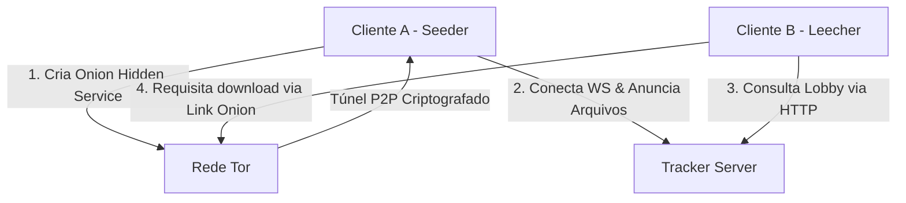

# 🧭 Guia de Funcionamento e Integração do Servidor Tracker (P2P)

Este documento detalha o funcionamento geral da rede Peer-to-Peer (P2P) do **AlLibrary**, explica o papel do **Servidor Tracker** e fornece o guia definitivo de como integrar e rodar o Tracker independente com o aplicativo cliente **DesktopApp_AlLibrary**.

---

## 🏷️ Sugestões de Nomes para o Tracker Server
Se você for publicar o repositório do Tracker no GitHub, sugerimos os seguintes nomes:

1. **`allibrary-beacon`** (Recomendado): *Beacon* significa "farol" ou "baliza". É uma excelente metáfora para um servidor que sinaliza a presença e coordenadas de nós no escuro da rede anônima Tor.
2. **`libra-tracker`**: Combina a palavra *Library* com *Libertarian* e a constelação Libra (balança, símbolo de ordem e equilíbrio).
3. **`allibrary-tracker-rs`**: Um nome direto que explicita a linguagem de programação utilizada (Rust).
4. **`allibrary-lobby-server`**: Identifica claramente a função prática do projeto, que é gerenciar o lobby global de compartilhamentos.

---

## 🌐 1. Como a Rede P2P do AlLibrary Funciona
O AlLibrary utiliza uma arquitetura híbrida de compartilhamento de arquivos com foco em **privacidade extrema, anonimato e resistência à censura**. 

Diferente de sistemas tradicionais baseados na Web convencional, a rede funciona assim:

1. **Camada de Transporte e Anonimato (Tor)**: 
   Toda a comunicação de transferência de arquivos ocorre via **Rede Tor**. Cada cliente executando o aplicativo AlLibrary inicia internamente seu próprio processo (daemon) do Tor e gera um endereço oculto local (`.onion`) utilizando a tecnologia do **Onion-Share**.
2. **Transferência Direta (Peer-to-Peer)**:
   Os arquivos são transmitidos diretamente entre o cliente semeador (Seeder) e o cliente baixador (Leecher) através de túneis criptografados ponta-a-ponta gerados pelo Tor. Nenhuma terceira parte armazena ou intercepta o arquivo.
3. **Coordenação e Descoberta (Tracker Server)**:
   Como a rede Tor não possui um serviço nativo de broadcast público global, nós precisamos de um ponto de encontro. O **Tracker Server** funciona como um "lobby de presença" ou "lista telefônica". 
   - Ele **não hospeda nem trafega arquivos**.
   - Ele guarda em memória uma lista temporária dos nós online e quais arquivos cada nó está compartilhando.



---

## 📡 2. O Papel do Tracker Server na Prática

O tracker gerencia as sessões dos usuários através de duas formas de comunicação:

* **Conexão WebSocket (`/ws`)**: O cliente Desktop abre um canal bidirecional persistente com o Tracker. Ao conectar, ele envia a lista de arquivos que está semeando. A cada 30 segundos, o Tracker verifica se o cliente ainda está ativo através de pings. Se o usuário fechar o aplicativo ou a internet dele cair, a conexão cai e o Tracker remove automaticamente seus arquivos do lobby global. Isso evita links quebrados e erros 404.
* **API REST HTTP**: O tracker expõe endpoints como `GET /lobby` (para baixar a lista global de arquivos online que é mostrada na aba *Buscar*) e `GET /swarm/:hash` (para saber quais IPs/Onions detêm um arquivo específico).

---

## 🔌 3. Como Integrar o Tracker Server no DesktopApp_AlLibrary

Caso você decida rodar um Tracker independente em um servidor VPS (AWS, DigitalOcean, etc.) ou em seu PC local para testes, você deve apontar o aplicativo desktop para ele. Siga as instruções abaixo:

### Passo A: Obter o endereço do Tracker
Ao subir o contêiner do seu tracker usando o Docker Compose na pasta `allibrary-tracker/`:
```bash
cd allibrary-tracker
docker compose up -d --build
```
Descubra qual domínio `.onion` a rede Tor gerou para o seu tracker executando:
```bash
docker compose exec tor_service cat /var/lib/tor/hidden_service/hostname
```
A saída será o link público do seu tracker, por exemplo:
`3anhnwqwxmjo7xsyxs3uoocdctxd3nwkfm5lt36xcwi4hfmkbttoktqd.onion`

### Passo B: Atualizar a URL no Código Rust
No código-fonte do cliente DesktopApp_AlLibrary, edite o arquivo de configurações de rede:
`src-tauri/src/onion_share/config.rs`

Localize a linha que define o endereço default do tracker (aproximadamente na linha 43) e atualize-a com o novo endereço `.onion` gerado (lembre-se de usar o prefixo `http://`, pois a rede Tor já cuida de toda a segurança de criptografia ponta-a-ponta):

```rust
impl Default for AppConfig {
    fn default() -> Self {
        Self {
            terms_accepted: false,
            tor_path: String::new(),
            node_id: uuid::Uuid::new_v4().to_string(),
            tracker_url: "http://SEU_DOMINIO_GERADO_AQUI.onion".to_string(), // <-- Altere aqui!
            share_publicly: true,
            try_local_tracker_fallback: true,
            bootstrap_peers: Vec::new(),
        }
    }
}
```

*Nota: Não inclua a porta `:8080` no link `.onion`, pois o Tor Hidden Service redireciona a porta virtual padrão HTTP (80) diretamente para a porta interna 8080 do servidor.*

### Passo C: Configuração em Tempo de Execução (Modo Teste Local)
Se você estiver rodando em ambiente de testes local sem rede Tor ativa para o tracker, você pode configurar o cliente diretamente pela interface gráfica:
1. Abra o **AlLibrary** e vá na aba de **Configurações**.
2. No campo **Tracker URL**, digite o endereço local `http://127.0.0.1:8080`.
3. Garanta que a opção **Try Local Tracker Fallback** esteja ativada.
4. Salve as alterações. O aplicativo passará a consultar o tracker diretamente na sua máquina host pela porta 8080.

---

## 📂 4. Estrutura do Novo Repositório do Tracker
Para gerenciar o Tracker de forma isolada, criamos a pasta `allibrary-tracker/` na raiz deste projeto. Ela já está configurada como um projeto Rust totalmente independente e otimizado com Docker:

```
allibrary-tracker/
├── 📄 Cargo.toml         # Configuração de dependências Rust
├── 📄 .gitignore         # Ignora chaves e compilações locais
├── 📄 README.md          # Instruções completas para deploy e uso do tracker
├── 📁 src/
│   ├── 📄 main.rs        # Código do servidor tracker (Axum + WebSockets)
│   └── 📄 protocol.rs    # Estrutura de mensagens de rede P2P
├── 📄 Dockerfile         # Dockerfile otimizado sem dependências gráficas
├── 📄 Dockerfile.tor     # Dockerfile para o proxy Tor integrado
├── 📄 docker-compose.yml # Orquestração do tracker + Tor
└── 📄 tor-entrypoint.sh  # Script de inicialização do Hidden Service
```

Você pode copiar esta pasta `allibrary-tracker` inteira e criar um novo repositório git independente no seu GitHub.
