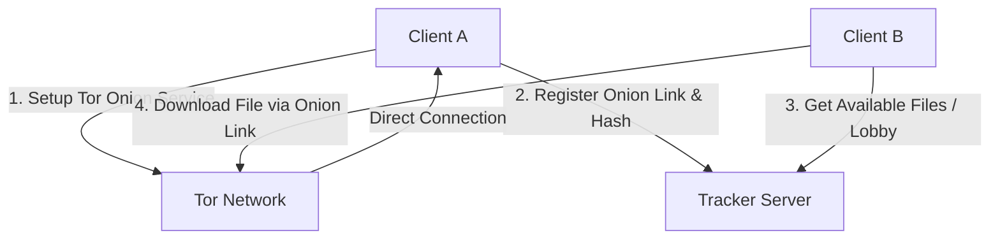

# 🌐 AlLibrary P2P & Tor Onion-Share Integration

AlLibrary features a fully decentralized, censorship-resistant, and anonymous Peer-to-Peer (P2P) file sharing infrastructure powered by **Tor Hidden Services** (`.onion`) and a lightweight tracking protocol.

This integration allows users to discover and transfer documents securely and anonymously without relying on a centralized file storage database.

---

## 🛠️ Architecture Overview

The P2P network is composed of three main components:
1. **Desktop App (Tauri + Rust + SolidJS)**: Each client runs an embedded Tor daemon and starts a local share server to host files over hidden services.
2. **Tor Network**: Provides anonymity and NAT traversal. All transfers happen via `.onion` links.
3. **Tracker Server**: A simple coordination lobby (running in Docker) that holds a directory of active nodes and online files. It does *not* host the files, but acts as a bulletin board.



---

## 📋 Key Features & Implementations

### 1. `FirstRunWizard` Setup
When starting AlLibrary for the first time, users go through a premium step-by-step configuration wizard:
- **Welcome Page**: Overview of privacy and sharing settings.
- **Tor Setup**: Connecting to the Tor network.
- **Share Folder**: Pick the local directory to share (seeded files).
- **Download Folder**: Pick a dedicated destination folder for received files.
- **Ready Screen**: Starts the background services.

Paths are persisted locally and sent to the Tauri backend using the `save_app_settings` command.

### 2. Zero-Search Discovery (`GlobalAcervo`)
A dashboard displaying all files currently shared on the network.
- **Automatic Sync**: Reads the cached lobby from the tracker (`trackerGetCachedLobby()`).
- **Live Counters**: Displays online node counts and active documents.
- **One-click Download**: Downloads files directly to the safe directory configured in the wizard.

### 3. Unified `DownloadManager`
To coordinate downloads across pages (e.g., triggering from `GlobalAcervo` and viewing progress in `PeerTransfers`):
- Acts as a singleton state manager for all Tor transfers.
- Simulates step-by-step progress updates for long-running Tor transfers.
- Listens to Rust backend events (`onion-share-fetch-done`) to flag downloads as `completed` or `failed`.
- Persists history in `localStorage`.

### 4. Real-time Monitoring (`Sidebar` & Network status)
- A background poller runs every 15 seconds to fetch the active node count from the lobby.
- Displays network status dynamically in the Sidebar and Footer.

---

## ⚙️ Running Locally & Docker Tracker

### Tracker Status Checks
To check tracker nodes via curl:
```bash
docker compose exec tracker curl -s http://localhost:8080/debug/nodes
```

### Starting the Client
To run the Desktop App in development:
```bash
pnpm install
pnpm run dev
```
Tauri will bootstrap the frontend, launch the embedded Tor binary, and initialize the P2P connection automatically.
