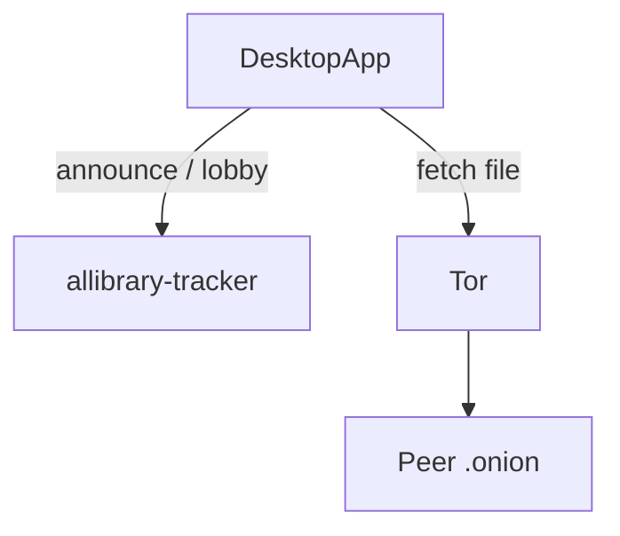

# Integração P2P & onion-share (desktop)

Como o **cliente** AlLibrary usa Tor e o tracker — alinhado ao código atual.

---

## Três peças

1. **Cliente (Tauri)** — Tor embarcado, servidor de share, cliente tracker, downloads SOCKS.
2. **Rede Tor** — Hidden services `.onion`, NAT traversal.
3. **Tracker** — Repo **`TrackerRust_AlLibrary`** (Docker). Só metadados em RAM.



---

## Boot do cliente (`App.tsx`)

Ordem aproximada:

1. First-run wizard (pasta projeto)
2. `initialize_app` + splash
3. `ensure_tor_for_onion_share`
4. `bootstrapOnionOverlay` — Tor + share + announce
5. Restore paths partilhados (`localStorage` `allibrary_shared_paths`)
6. `init_tor_node` — opcional/legado

Progresso: evento Tauri `init-progress`.

---

## API frontend → Rust

| TS (`onionShareService`) | Comando Tauri |
|--------------------------|---------------|
| `bootstrapOnionOverlay` | `bootstrap_onion_overlay` |
| `onionShareAddFile` | `onion_share_add_file` |
| `onionShareListLocal` | `onion_share_list_local` |
| `onionShareFetch` | `onion_share_fetch` |
| `trackerRefreshLobby` | `tracker_refresh_lobby` |
| `trackerGetCachedLobby` | `tracker_get_cached_lobby_cmd` |
| `trackerSetConfig` | `tracker_set_config` |

Config default Rust: `src-tauri/src/onion_share/config.rs`.

---

## O que está integrado vs. shell UI

| Funcional | Parcial / mock |
|-----------|----------------|
| Start Tor + share no boot | Throughput Mbps no Home |
| Announce + lobby cache | Peer Network page (peers fictícios) |
| Add/remove local shares | Trending, Browse, Favorites, Recent |
| Download via `downloadManager` | Search Network “download result” |
| Tracker URL em Configurations | Settings route (`/settings` missing) |
| Global Acervo (POC) | Network graphs mock |

Roadmap: [integration/README.md](./integration/README.md).

---

## FirstRunWizard

- Pasta de projeto (biblioteca local)
- Download folder (via settings — alinhar com Rust `FolderStructure`)
- Persistência: `save_app_settings` + `settingsService`

---

## DownloadManager

- Singleton TS
- Progresso intermediário simulado (Tor não envia chunks)
- Conclusão: evento `onion-share-fetch-done`
- Histórico: `localStorage` → migrar para SQLite `transfers`

---

## Sidebar / footer

- `fetchNetworkPresence` / `trackerGetCachedLobby` — nós online
- `get_disk_space_info` — barra de storage

Badges “12” / “8” no menu: **hardcoded** — ignorar como métrica real.

---

## Tracker local

```bash
cd TrackerRust_AlLibrary
docker compose up -d --build
```

Teste: `http://127.0.0.1:8080/lobby` ou Configurations com URL localhost.

Legado: `DesktopApp_AlLibrary/deploy/` — mesma ideia, manter um só repo.

---

## libp2p / IPFS

Comandos Tauri (`init_p2p_node`, `search_p2p_network`, Kademlia em `network_shell.rs`) **não** alimentam as páginas Discovery actuais. Não documentar como caminho do utilizador até re-ligação explícita.

---

## Referências

- [TRACKER_SERVER.md](./TRACKER_SERVER.md)
- [TESTING_P2P.md](./TESTING_P2P.md)
- [DETALHAMENTO_P2P_E_DESCOBRIMENTO.md](./DETALHAMENTO_P2P_E_DESCOBRIMENTO.md)
