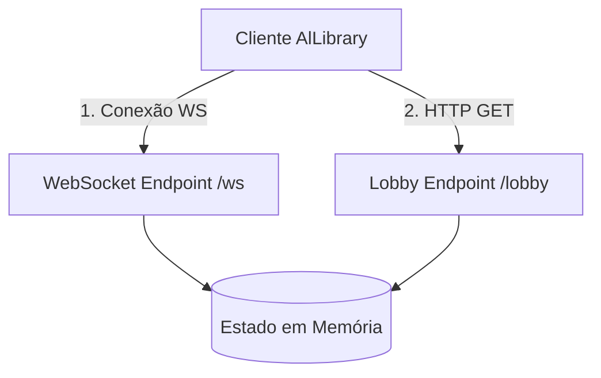

# 🧭 Servidor Tracker: Funcionamento e Protocolo

Este documento detalha o funcionamento interno do **Servidor Tracker**, a estrutura de dados que ele gerencia, os protocolos de comunicação HTTP e WebSocket, e como extrair essa peça para um repositório independente no futuro.

---

## ❓ O que é o Tracker Server?

O Tracker é um servidor de coordenação centralizado de baixíssima pegada (footprint). Ele **não recebe, não armazena e não transmite os arquivos** compartilhados pelos usuários. 

Sua única responsabilidade é responder à pergunta:
> *"Quais nós (.onion) estão online agora e quais arquivos cada um está compartilhando?"*

---

## 🛠️ Arquitetura Interna do Servidor

O tracker roda em segundo plano em um contêiner Docker (geralmente sob a porta `8080`). Ele gerencia as conexões utilizando duas camadas de protocolo:

1. **REST API (HTTP)**: Utilizado para consultas rápidas e compatibilidade de polling legada.
2. **WebSocket (WS)**: Canal de comunicação bidirecional persistente. Mantém a presença do nó viva e atualiza o lobby em tempo real.



---

## 📡 Protocolo e Endpoints do Servidor

Se você decidir reescrever o Tracker Server em outra linguagem (como Node.js, Go ou Python) no futuro, seu servidor precisará expor os seguintes endpoints na porta configurada:

### 1. `GET /lobby`
Retorna a lista completa de arquivos compartilhados por todos os clientes online na rede, bem como a quantidade de nós conectados.

*   **Resposta JSON esperada (`NetworkLobby`)**:
    ```json
    {
      "online_nodes": 3,
      "files": [
        {
          "name": "tcc_versao_final.pdf",
          "size": 2458102,
          "link": "http://3anhnwqwxmjo...onion/tcc_versao_final.pdf",
          "content_hash": "a1b2c3d4e5f6...",
          "peer_count": 1
        }
      ]
    }
    ```

### 2. `GET /debug/nodes`
Endpoint de depuração que retorna a lista crua de nós conhecidos pelo servidor e o status de suas conexões WebSocket.
*   **Comando de execução (no contêiner)**:
    ```bash
    docker compose exec tracker curl -s http://localhost:8080/debug/nodes
    ```

### 3. `GET /ws` (WebSocket)
O canal de presença oficial introduzido na versão `0.7.4`.
*   **Handshake**: O cliente inicia uma conexão WebSocket.
*   **Registro**: Ao conectar, o cliente envia uma mensagem JSON anunciando seu ID de Nó (`node_id`), seu link `.onion` público gerado pelo Tor e a lista de arquivos que está compartilhando.
*   **Heartbeat / Ping**: O servidor envia pings periódicos (ex: a cada 30 segundos) para verificar se o cliente ainda está ativo.
*   **Auto-Cleanup (Desconexão)**: Se o cliente fechar o aplicativo ou perder a conexão de internet, o canal WebSocket será fechado. O Tracker detecta isso imediatamente e remove todos os arquivos daquele nó da lista ativa, evitando links quebrados no lobby global.

---

## 📦 Como Separar o Servidor Tracker do Repositório Principal

Atualmente, os arquivos de deploy do Tracker estão na pasta `deploy/`. Para criar um repositório exclusivo para o Tracker:

1. **Crie um novo repositório git** (ex: `allibrary-tracker`).
2. **Copie os arquivos da pasta `deploy/`**:
   * `Dockerfile`: Que compila e expõe a aplicação Rust do Tracker.
   * `Dockerfile.tor`: Contêiner auxiliar do Tor para prover o endereço oculto do Tracker.
   * `docker-compose.yml`: Define a rede integrada entre o contêiner do Tracker e o contêiner do Tor.
   * `tor-entrypoint.sh`: Shell script de inicialização do Tor Hidden Service.
3. **Código-Fonte do Tracker**: Certifique-se de mover o subprojeto Rust responsável pelo servidor tracker (geralmente uma subpasta no workspace do Cargo ou um arquivo separado) para a raiz do novo repositório.

### Dica de Segurança e Endereço Onion Fixo
As chaves do endereço `.onion` do seu Tracker ficam salvas no volume `tor_keys` do Docker. Faça o backup desse diretório sempre que migrar de servidor VPS. Sem ele, um novo endereço `.onion` será gerado, invalidando a URL do Tracker configurada no cliente compilado dos seus usuários.
