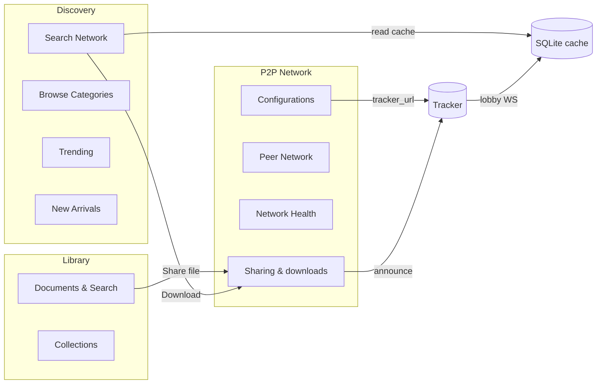

# POC Retirement & Capability Migration

Two UI areas were **proof-of-concept** surfaces. They validated onion-share + tracker but are **not** the final product layout. Before deletion, their **capabilities** must exist elsewhere.

## Screens / panels to delete (Phase C)

| Item | Path / location | Route |
|------|-----------------|-------|
| Global Acervo page | `src/pages/GlobalAcervo/` | `/acervo` |
| Onion mesh (live) panel | `PeerTransfers.tsx` → `Card.onionPanel` | `/transfers`, `/sharing`, `/downloads` |

Also remove from navigation (`Sidebar.tsx`): **Global Acervo** nav item; optionally rename Discovery flow to use Search Network as primary.

---

## Global Acervo — capabilities to preserve

### What the POC did well

| Capability | Implementation today |
|------------|---------------------|
| Load network file list | `trackerGetCachedLobby` / `trackerRefreshLobby` |
| Show nodes online, file count, total size | From `NetworkLobby` |
| Onion active indicator | `onionShareStatus` |
| Per-file download | `downloadManager.startDownload(link, name, dlFolder)` |
| Download progress / retry | `downloadManager.subscribe` |
| Self-download guard | Skip when link contains own `.onion` |
| Auto-refresh (30s) | Page-local interval |

### Where capabilities must land

| Capability | Target screen(s) | Notes |
|------------|------------------|-------|
| Full lobby listing (no search) | **Search Network** — default tab loads all files when query empty | Already calls `searchNetwork('')` via lobby filter; make default on mount |
| Network file cards + download | **Search Network** results, **DocumentManagement** (network tab if added) | Use shared `NetworkFileCard` component |
| Download progress | **Sharing & downloads** inbound table + **Home** downloads tab | Single `downloadManager` subscription |
| Empty state (“start onion share”) | **Sharing & downloads** header + **Home** network strip | When `!onionShareStatus().running` |
| Stats ribbon (nodes, docs, size) | **Search Network** overview, **Home** overview, **Sidebar** footer | Already partial in Sidebar |
| Refresh lobby | **Connection Manager** (“Sync now”) + background WS loop | `tracker_refresh_lobby` + `tracker_start_ws_loop` on boot |

### Migration tasks

- [ ] Extract `GlobalAcervo` download + card logic into `src/components/domain/network/NetworkFileCard/` (or extend `DocumentCard` with `source: 'network'`)
- [ ] Add `useNetworkLobby()` hook — wraps cached lobby, refresh, SQLite fallback (see doc 03)
- [ ] Search Network: on mount, if Tor/onion ready → `search({ query: '' })` (replace Global Acervo auto-browse)
- [ ] Remove `/acervo` route and sidebar link after above works
- [ ] Delete `src/pages/GlobalAcervo/` directory

---

## Onion mesh (live) — capabilities to preserve

### What the POC panel exposed

| Control | Tauri / service |
|---------|-----------------|
| Start / Stop onion share | `onionShareStart`, `onionShareStop` |
| Pick & add share (single / multiple) | `pickAnyFiles`, `onionShareAddFile` |
| Remove share | `onionShareRemoveFile` |
| Local manifests list | `onionShareListLocal` |
| Download by link (`opoc://`, `opocswarm://`) | `onionShareFetch` |
| Pick output folder | `pickFolder` + `settingsService.getDownloadFolder` |
| Tracker HTTP refresh | `trackerRefreshLobby` |
| Tracker WS start/stop | `trackerStartWsLoop`, `trackerStopWsLoop` |
| Lobby snippet (debug) | `trackerGetCachedLobby` |
| Persist shared paths | `localStorage` `allibrary_shared_paths` |

### Where capabilities must land

| Capability | Target | Improvement over POC |
|------------|--------|----------------------|
| Start/stop onion | **App bootstrap** (keep) + **Sharing & downloads** compact status bar only | Remove duplicate debug toolbar |
| Add/remove shares | **Sharing & downloads** — outbound table + “Add files” (already partial) | Drop raw path text field; keep picker-first UX |
| Local share list | **Outbound table** from `onionShareListLocal` / SQLite `local_shares` | Remove `MOCK_OUTBOUND` fallback |
| Download by link | **Sharing & downloads** — “Add download” modal | Keep opoc link support |
| Tracker sync | **Automatic** on boot (`bootstrapOnionOverlay`) + WS loop | Hide manual WS buttons from users; dev flag optional |
| Tracker URL config | **Connection Manager** (already) | — |
| Restore shares on boot | **App.tsx** (already) | Move path list to SQLite `local_shares` |

### Migration tasks

- [ ] Move share-restore from `localStorage` `allibrary_shared_paths` → SQLite `local_shares.disk_path` on boot
- [ ] **Sharing & downloads**: remove `onionPanel` section; keep header status (onion address, start/stop if not auto-started)
- [ ] Wire outbound table **only** to real data; empty state CTA “Add files to share”
- [ ] Wire inbound table **only** to `downloadManager`; remove `MOCK_INBOUND` / `MOCK_COMPLETED`
- [ ] Consolidate manual fetch form into one “Download from network link” dialog (not full debug panel)
- [ ] Connection Manager: optional “Advanced” collapsible with tracker sync diag (`trackerGetLastSyncDiag`) replacing lobby snippet textarea

---

## Shared types (keep one source)

Align frontend and Rust on tracker protocol types (already duplicated):

| Rust | TypeScript |
|------|------------|
| `onion_share/tracker_proto.rs` | `onionShareService.ts` `NetworkLobby` |
| Desktop `bin/tracker.rs` | **Delete** when standalone `TrackerRust_AlLibrary` is canonical |

**Task:** [ ] Shared crate or code-gen from `tracker_proto.rs`; frontend imports generated types or single hand-maintained `src/types/NetworkLobby.ts`.

---

## User-visible flow after migration

No standalone “Global Acervo” or debug “Onion mesh” — network library is **Search Network + cached DB**, operations are **Sharing & downloads + Configurations**.
